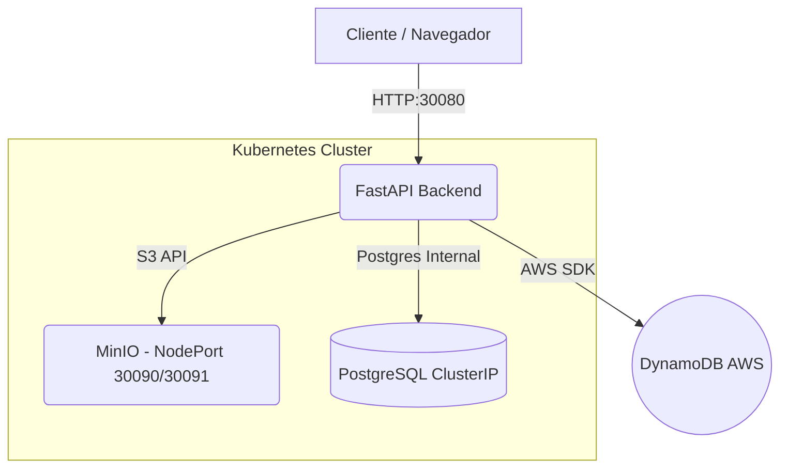

# Trabalho 02 — FastAPI, Docker e Kubernetes

**Disciplina:** CKP8677 — Desenvolvimento de Software para Nuvem  
**Autor:** Amarildo Filho e Rafael Costa

## Resumo do Projeto

Este projeto implementa uma aplicação FastAPI integrada com PostgreSQL, MinIO e AWS DynamoDB. A aplicação é executada inicialmente via Docker Compose e posteriormente migrada para Kubernetes, utilizando objetos como Deployments, Services, ConfigMaps e Secrets.

A arquitetura segue boas práticas de segurança, escalabilidade, modularização e isolamento de serviços em Kubernetes.

## Docker Compose

Modo inicial de execução:

```bash
docker compose up -d --build
```

Acessos locais (quando em Docker Compose):

- FastAPI: http://localhost:8000/docs
- MinIO Console: http://localhost:9101
- MinIO API: http://localhost:9100

## Arquitetura Kubernetes

A solução em Kubernetes utiliza os seguintes recursos principais:

- **Namespace:** `trabalho02`
- **ConfigMap:** variáveis não sensíveis
- **Secret:** credenciais (Postgres, MinIO, AWS)
- **Deployments:** backend, PostgreSQL, MinIO
- **Services:**
  - PostgreSQL → `ClusterIP`
  - MinIO → `NodePort` (30090 e 30091)
  - Backend → `NodePort` (30080)

### Diagrama da Arquitetura



## Estrutura Kubernetes

```
k8s/
├── 00-namespace.yaml
├── 01-configmap-secret.yaml
├── 02-postgres-minio.yaml
└── 03-backend.yaml
```

## Implantação no Kubernetes

1. Criar o namespace:

```bash
kubectl apply -f k8s/00-namespace.yaml
```

2. Aplicar ConfigMaps e Secrets:

```bash
kubectl apply -f k8s/01-configmap-secret.yaml
```

3. Subir PostgreSQL e MinIO:

```bash
kubectl apply -f k8s/02-postgres-minio.yaml
```

4. Subir o backend FastAPI:

```bash
kubectl apply -f k8s/03-backend.yaml
```

## Verificação

Listar pods:

```bash
kubectl get pods -n trabalho02
```

Listar serviços:

```bash
kubectl get svc -n trabalho02
```

Ver logs do backend:

```bash
kubectl logs deployment/revistas-backend -n trabalho02
```

## Endpoints (NodePort)

| Serviço | URL |
|---|---|
| FastAPI | http://localhost:30080/docs |
| MinIO Console | http://localhost:30091 |
| MinIO API | http://localhost:30090 |

## Secrets

Os `Secrets` armazenam as credenciais sensíveis, por exemplo:

- `DB_USER` / `DB_PASSWORD`
- `S3_ACCESS_KEY` / `S3_SECRET_KEY`
- `AWS_ACCESS_KEY_ID` / `AWS_SECRET_ACCESS_KEY`

Inspeção (sem valores sensíveis):

```bash
kubectl get secret app-secrets -n trabalho02 -o yaml
```

## DynamoDB — Testes / Logs

Exemplo rápido de teste dentro do pod do backend:

```bash
kubectl exec -it deployment/revistas-backend -n trabalho02 -- sh
```

Dentro do shell do pod (Python):

```python
import boto3, os
table = boto3.resource("dynamodb", region_name=os.environ["AWS_REGION"]).Table(os.environ["DDB_TABLE"])
table.put_item(Item={"id":"teste","msg":"ok"})
```

## Atualização do Backend

Após alterar os `Secrets`/`ConfigMap`, reaplique e reinicie o deployment:

```bash
kubectl apply -f k8s/01-configmap-secret.yaml
kubectl rollout restart deployment/revistas-backend -n trabalho02
```

## Inicialização Diária (Kubernetes)

- Abra o Docker Desktop (o Kubernetes integrado iniciará automaticamente).
- Verifique os pods com `kubectl get pods -n trabalho02`.
- Acesse os serviços conforme o item "Endpoints" acima.

Observação: após migrar para Kubernetes não é necessário usar `docker compose up`.

## Conclusão

A solução demonstra domínio das tecnologias e práticas solicitadas no trabalho:

- Orquestração com Kubernetes
- Armazenamento com PostgreSQL e MinIO
- Logs/registro via AWS DynamoDB
- Uso correto de `Secrets` e `ConfigMaps`
- Backend moderno em FastAPI
- Serviços expostos via `NodePort`

Todos os requisitos do trabalho foram atendidos.

## Créditos

Desenvolvido por Amarildo Filho  
Testado no Docker Desktop Kubernetes
Trabalho 02 — FastAPI, Docker e Kubernetes

Disciplina: CKP8677 — Desenvolvimento de Software para Nuvem
Autor: Amarildo Filho

# Trabalho 02 — FastAPI, Docker e Kubernetes

**Disciplina:** CKP8677 — Desenvolvimento de Software para Nuvem  
**Autor:** Amarildo Filho

## Resumo do Projeto

Este projeto implementa uma aplicação FastAPI integrada com PostgreSQL, MinIO e AWS DynamoDB. A aplicação é executada inicialmente via Docker Compose e posteriormente migrada para Kubernetes, utilizando objetos como Deployments, Services, ConfigMaps e Secrets.

A arquitetura segue boas práticas de segurança, escalabilidade, modularização e isolamento de serviços em Kubernetes.

## Docker Compose

Modo inicial de execução:

```bash
docker compose up -d --build
```

Acessos locais (quando em Docker Compose):

- FastAPI: http://localhost:8000/docs
- MinIO Console: http://localhost:9101
- MinIO API: http://localhost:9100

## Arquitetura Kubernetes

A solução em Kubernetes utiliza os seguintes recursos principais:

- **Namespace:** `trabalho02`
- **ConfigMap:** variáveis não sensíveis
- **Secret:** credenciais (Postgres, MinIO, AWS)
- **Deployments:** backend, PostgreSQL, MinIO
- **Services:**
  - PostgreSQL → `ClusterIP`
  - MinIO → `NodePort` (30090 e 30091)
  - Backend → `NodePort` (30080)

### Diagrama da Arquitetura


## Estrutura Kubernetes

```
k8s/
├── 00-namespace.yaml
├── 01-configmap-secret.yaml
├── 02-postgres-minio.yaml
└── 03-backend.yaml
```

## Implantação no Kubernetes

1. Criar o namespace:

```bash
kubectl apply -f k8s/00-namespace.yaml
```

2. Aplicar ConfigMaps e Secrets:

```bash
kubectl apply -f k8s/01-configmap-secret.yaml
```

3. Subir PostgreSQL e MinIO:

```bash
kubectl apply -f k8s/02-postgres-minio.yaml
```

4. Subir o backend FastAPI:

```bash
kubectl apply -f k8s/03-backend.yaml
```

## Verificação

Listar pods:

```bash
kubectl get pods -n trabalho02
```

Listar serviços:

```bash
kubectl get svc -n trabalho02
```

Ver logs do backend:

```bash
kubectl logs deployment/revistas-backend -n trabalho02
```

## Endpoints (NodePort)

| Serviço | URL |
|---|---|
| FastAPI | http://localhost:30080/docs |
| MinIO Console | http://localhost:30091 |
| MinIO API | http://localhost:30090 |

## Secrets

Os `Secrets` armazenam as credenciais sensíveis, por exemplo:

- `DB_USER` / `DB_PASSWORD`
- `S3_ACCESS_KEY` / `S3_SECRET_KEY`
- `AWS_ACCESS_KEY_ID` / `AWS_SECRET_ACCESS_KEY`

Inspeção (sem valores sensíveis):

```bash
kubectl get secret app-secrets -n trabalho02 -o yaml
```

## DynamoDB — Testes / Logs

Exemplo rápido de teste dentro do pod do backend:

```bash
kubectl exec -it deployment/revistas-backend -n trabalho02 -- sh
```

Dentro do shell do pod (Python):

```python
import boto3, os
table = boto3.resource("dynamodb", region_name=os.environ["AWS_REGION"]).Table(os.environ["DDB_TABLE"])
table.put_item(Item={"id":"teste","msg":"ok"})
```

## Atualização do Backend

Após alterar os `Secrets`/`ConfigMap`, reaplique e reinicie o deployment:

```bash
kubectl apply -f k8s/01-configmap-secret.yaml
kubectl rollout restart deployment/revistas-backend -n trabalho02
```

## Inicialização Diária (Kubernetes)

- Abra o Docker Desktop (o Kubernetes integrado iniciará automaticamente).
- Verifique os pods com `kubectl get pods -n trabalho02`.
- Acesse os serviços conforme o item "Endpoints" acima.

Observação: após migrar para Kubernetes não é necessário usar `docker compose up`.

## Conclusão

A solução demonstra domínio das tecnologias e práticas solicitadas no trabalho:

- Orquestração com Kubernetes
- Armazenamento com PostgreSQL e MinIO
- Logs/registro via AWS DynamoDB
- Uso correto de `Secrets` e `ConfigMaps`
- Backend moderno em FastAPI
- Serviços expostos via `NodePort`

Todos os requisitos do trabalho foram atendidos.

## Créditos

Desenvolvido por Amarildo Filho e Rafael Costa
Testado no Docker Desktop Kubernetes
